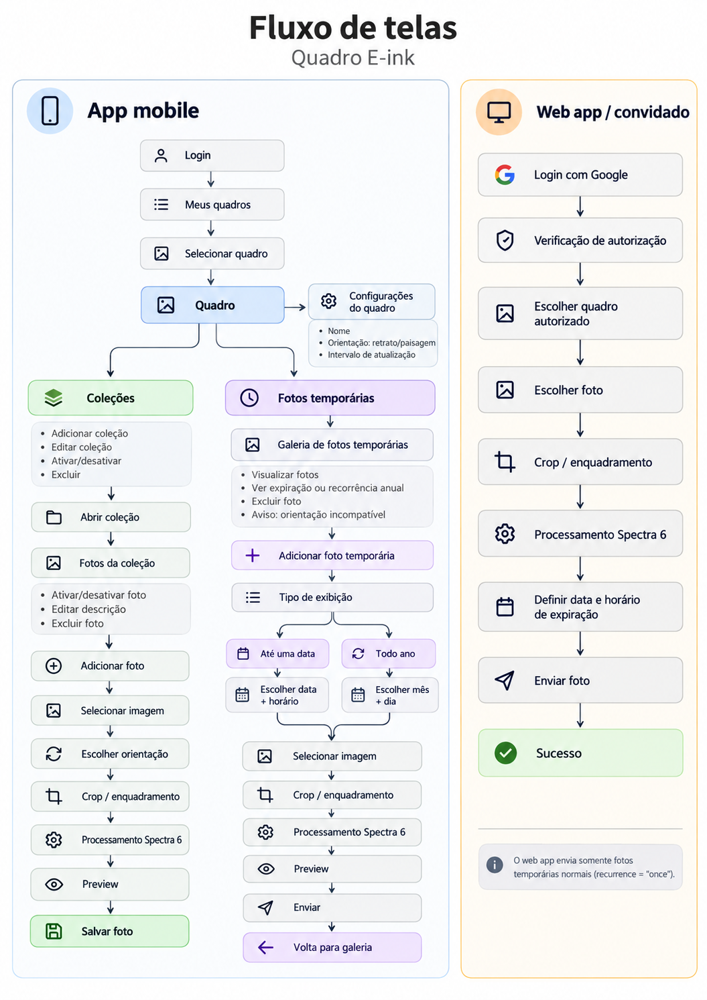
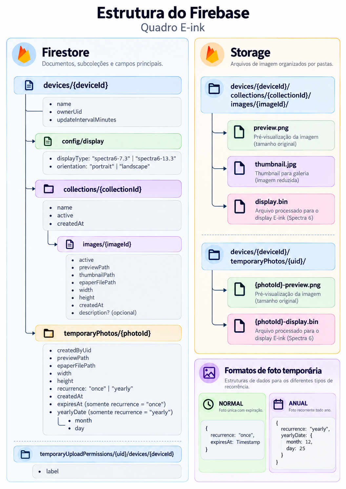

# Quadro E-ink

Aplicativo para gerenciamento de quadros digitais E-ink utilizando displays Spectra 6.

O projeto permite organizar coleções de fotos, processar imagens para a paleta do display, enviar fotos temporárias e controlar quais imagens devem aparecer no quadro.

Além do aplicativo mobile, existe um web app simplificado que permite que usuários autorizados enviem fotos temporárias para um quadro.

## Funcionalidades

### App mobile

- Login com Firebase Authentication
- Cadastro e gerenciamento de quadros
- Suporte aos displays:
  - Spectra 6 7.3"
  - Spectra 6 13.3"
- Orientação retrato e paisagem
- Configuração do intervalo de atualização do quadro
- Criação e gerenciamento de coleções
- Ativação e desativação de coleções
- Upload e gerenciamento de fotos
- Descrição opcional para fotos
- Crop e enquadramento antes do processamento
- Conversão das imagens para a paleta Spectra 6
- Geração do arquivo binário utilizado pelo display
- Preview da imagem processada
- Fotos temporárias com expiração
- Fotos temporárias com recorrência anual
- Aviso de orientação incompatível

### Fotos temporárias

Existem dois tipos de foto temporária.

#### Exibição única

A imagem é válida até uma data e horário definidos.

```text
recurrence: "once"
expiresAt: Timestamp
```

#### Recorrência anual

A imagem fica programada para aparecer todo ano em uma determinada data.

```text
recurrence: "yearly"

yearlyDate:
  month: 12
  day: 25
```

### Web app

O web app permite que convidados autorizados enviem fotos temporárias sem precisar utilizar o aplicativo mobile.

Fluxo:

```text
Login com Google
→ Verificação de autorização
→ Escolher quadro autorizado
→ Escolher foto
→ Crop / enquadramento
→ Processamento Spectra 6
→ Definir data e horário de expiração
→ Enviar
```

O web app suporta apenas fotos temporárias do tipo:

```text
recurrence: "once"
```

## Fluxo de telas



## Firebase

O projeto utiliza:

- Firebase Authentication
- Cloud Firestore
- Firebase Storage
- Firebase Hosting

A estrutura principal de dados e arquivos está representada abaixo.



## Processamento de imagem

As imagens são processadas antes do envio para o quadro.

```text
Imagem original
→ Crop
→ Resize para a resolução do display
→ Conversão para a paleta Spectra 6
→ Preview
→ Arquivo display.bin
```

O arquivo `display.bin` é o arquivo utilizado pelo firmware para desenhar a imagem no display E-ink.

## Desenvolvimento

### App mobile

O aplicativo utiliza Expo / React Native.

#### Build da plataforma de desenvolvimento

```bash
eas build --profile development --platform android
```

#### Rodar com development build

```bash
npx expo start --dev-client
```

O development build precisa estar instalado no dispositivo antes de executar esse comando.

#### Gerar APK de preview

```bash
eas build -p android --profile preview
```

## Web app

### Rodar localmente

```bash
npx expo start --web -c
```

O `-c` limpa o cache do Expo antes de iniciar.

### Gerar build e publicar

Gerar os arquivos estáticos:

```bash
npx expo export -p web
```

Os arquivos são gerados em:

```text
dist/
```

Publicar no Firebase Hosting:

```bash
firebase deploy --only hosting
```

Fluxo completo:

```bash
npx expo export -p web
firebase deploy --only hosting
```

## Estrutura geral

```text
Quadro E-ink

App mobile
├── gerenciamento de quadros
├── configurações do display
├── coleções
├── fotos
├── fotos temporárias
└── processamento Spectra 6

Web app
├── autenticação Google
├── autorização por quadro
├── seleção de foto
├── crop
├── processamento Spectra 6
└── envio de foto temporária

Firebase
├── Authentication
├── Firestore
├── Storage
└── Hosting

Firmware
└── ESP32 + display Spectra 6
```

## Status do projeto

### Aplicativo mobile

Implementado:

- gerenciamento de quadros
- gerenciamento de coleções
- gerenciamento de fotos
- processamento Spectra 6
- fotos temporárias
- recorrência anual
- controle de orientação

### Web app

Implementado:

- autenticação Google
- controle de autorização
- envio de fotos temporárias
- processamento da imagem diretamente no navegador
- publicação via Firebase Hosting

### Firmware

O firmware será responsável por:

- sincronizar fotos e configurações
- armazenar imagens localmente
- selecionar a próxima imagem
- interpretar fotos temporárias
- interpretar recorrências anuais
- atualizar o display E-ink
- utilizar deep sleep para reduzir o consumo de bateria

## Tecnologias

- React Native
- Expo
- TypeScript
- Firebase Authentication
- Cloud Firestore
- Firebase Storage
- Firebase Hosting
- ESP32
- Spectra 6

## Displays suportados

### Spectra 6 7.3"

```text
800 × 480
```

### Spectra 6 13.3"

```text
1600 × 1200
```

As duas resoluções podem ser utilizadas em orientação retrato ou paisagem.
